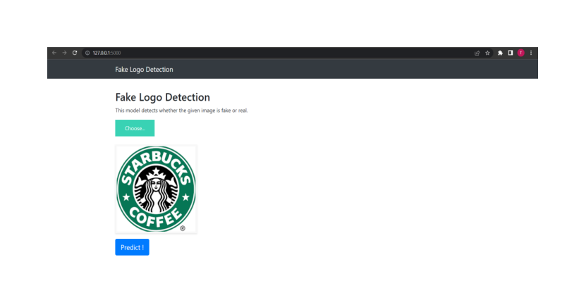
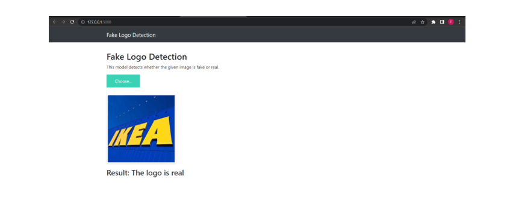
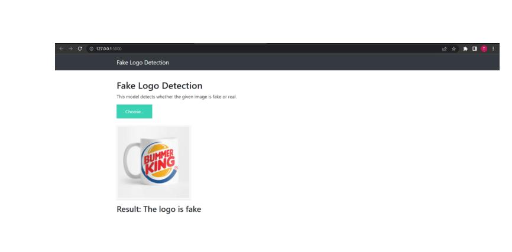
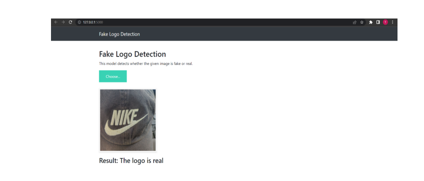

# Fake-Logo-Detection
This Fake Logo Detection model helps in detecting the fake and original logos of 15 different brands like Puma, Nike, Starbucks, Adidias, HP, Apple etc. This model is built using CNN architecture and deployed in the web using Flask Framework.

<Strong><Span:Color:blue">"Check the Master Branch for the project files."<Strong>

  <strong>Fake Logo Detection Website</strong>

 
 

  <strong>User Uploading Logo For Checking</strong>

 
 

  <strong>Model Displaying The Result</strong>

 
 

  <strong>Model Detecting Fake Logo as Fake</strong>

 
 

  <strong>Model Detecting Original Logo as Original</strong>

 
 

